# Pharmacy Management System 💊

A modern, responsive web-based Pharmacy Management System built with Next.js 15, TypeScript, Tailwind CSS, shadcn/ui, and Radix UI components.

## 👨‍⚕️ Overview

This project simulates a full-featured Pharmacy Management System for patients and pharmacists.  
It includes inventory tracking, prescription management, billing, insurance, and patient information management.

---

## 🚀 Features

- User authentication & registration
- Pharmacist dashboard with inventory, sales, and reporting
- Patient portal to view prescriptions and update information
- Modern UI with dark/light mode toggle
- Built using Next.js 15 App Router and shadcn/ui components

---

## 📸 View

### 🔐 Common (Both Roles)
### Mobile View
| Login | Register |
|-------|----------|
| 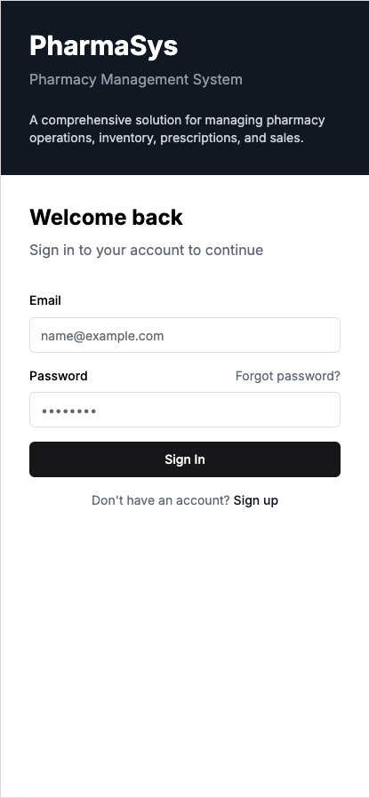 | 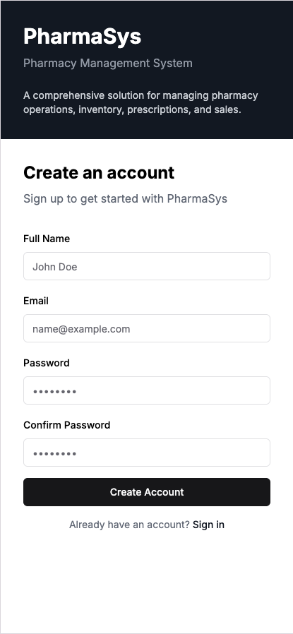 |

### Dashboard View
| Login | Register |
|-------|----------|
|  |  |

---

### 💊 Pharmacist View
| Dashboard | Inventory | Patient Management |
|-----------|-----------|--------------------|
| 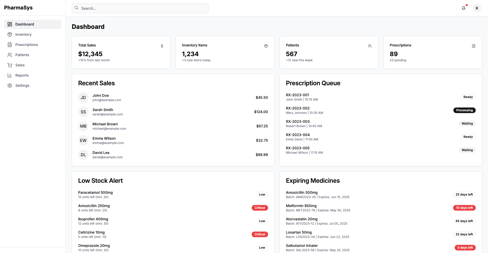 | 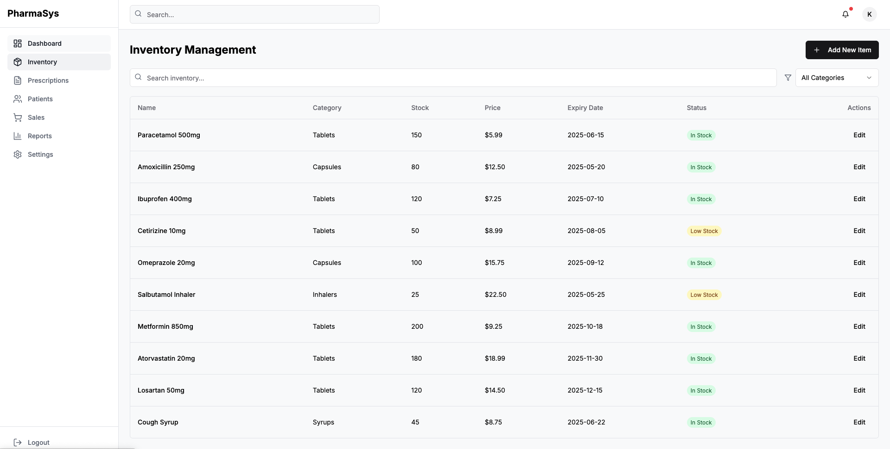 | 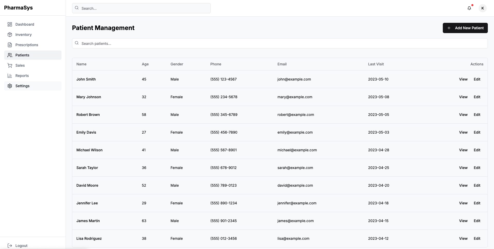 |

| Reports | Sales & Billing | Prescriptions |
|---------|-----------------| --------------|
| 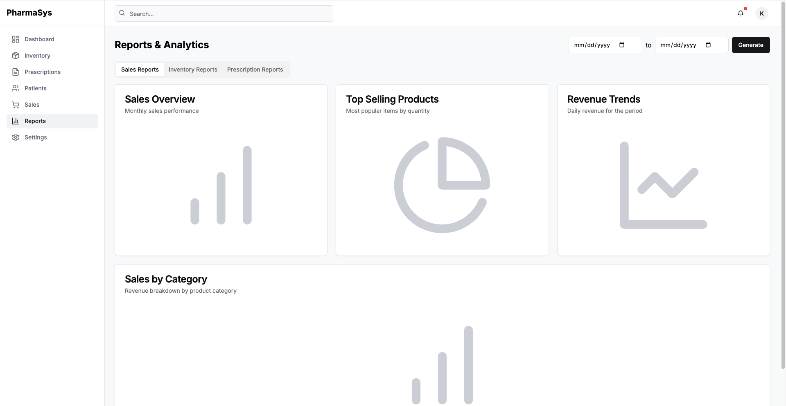 | 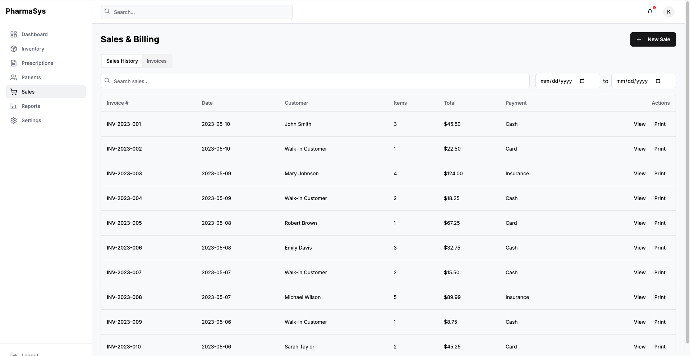 | 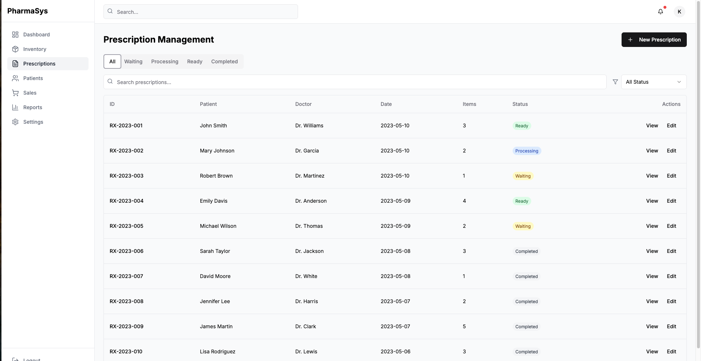 |

---

### 🧑 Patient View
| Dashboard | My Prescriptions | Prescription page 1 |
|----------|------------------|----------------|
| 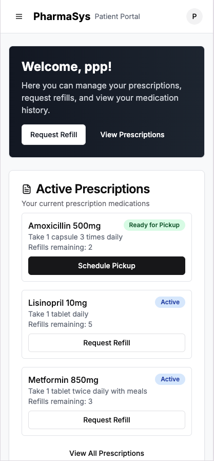 | 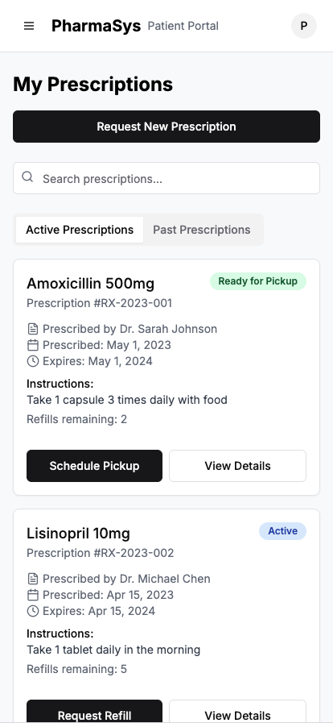 | 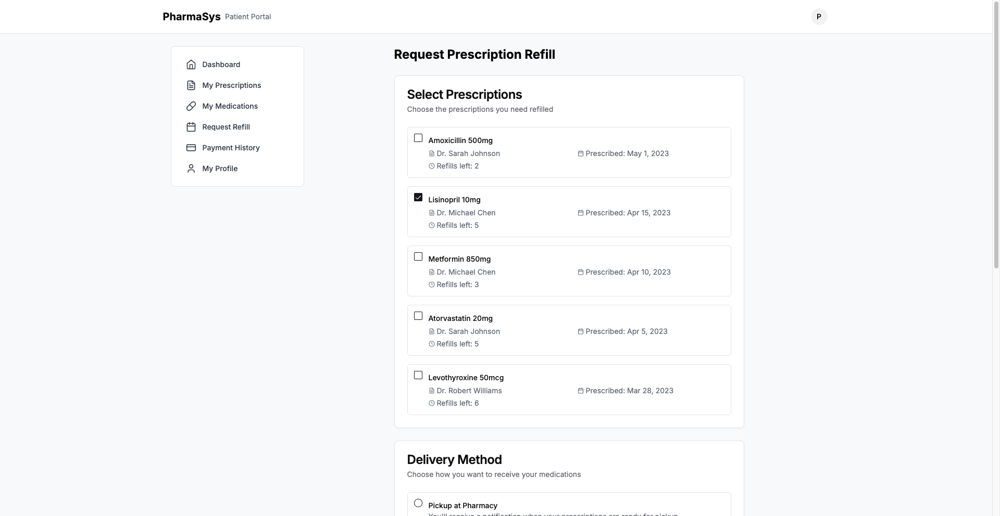 |

| Dashboard Desktop View | Dashboard Desktop View | Personal Info |
|------------------------|------------------------|---------------|
| 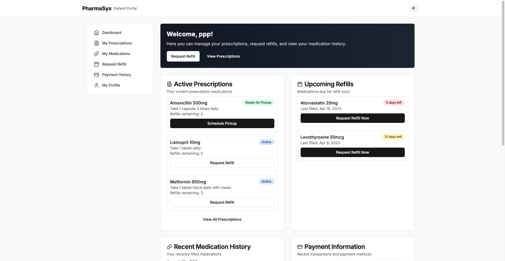 | 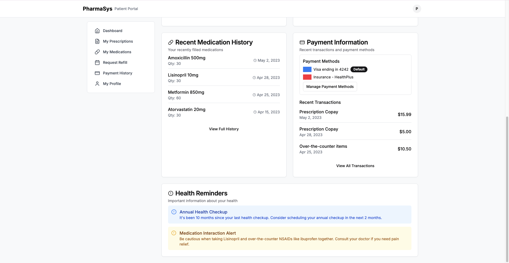 | 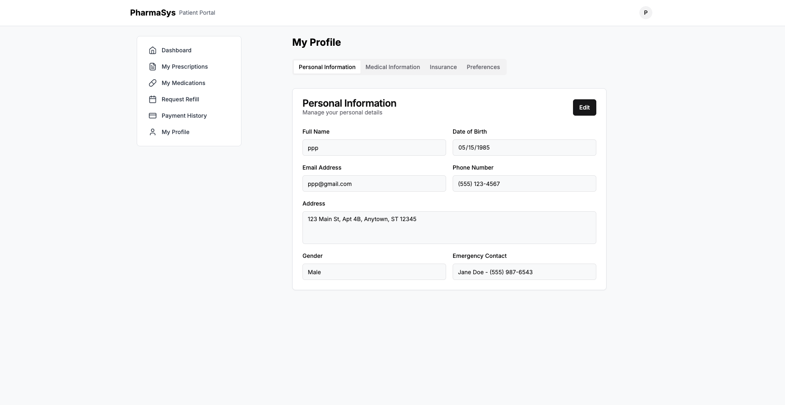 |

| Home Delivery Option | Pickup Option | Communication Preferences |
|----------------------|---------------|--------------------------|
| 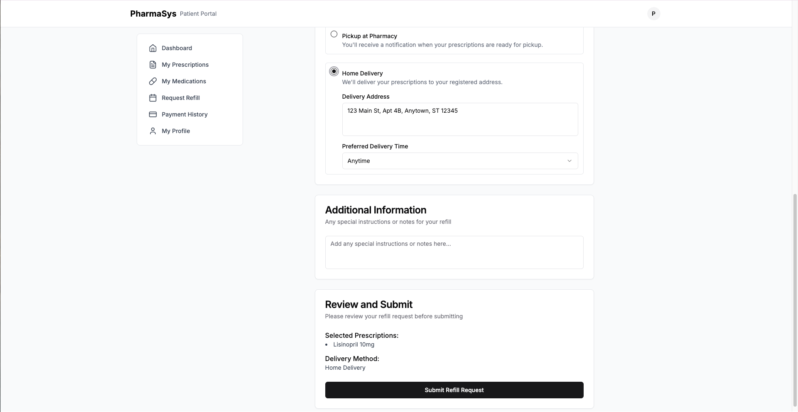 | 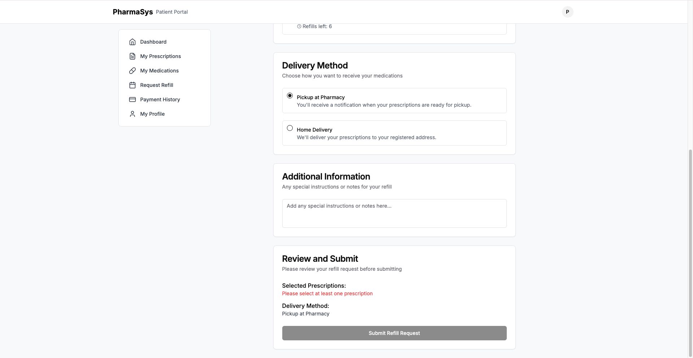 | 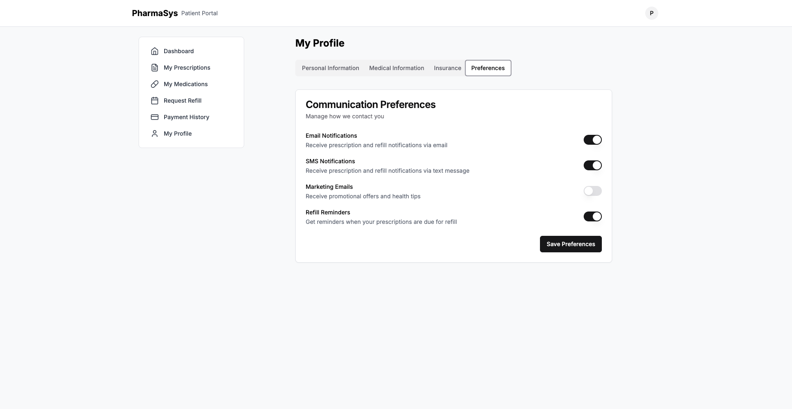 |

| Insurance | Medical Info |
|----------|--------------|
|  | 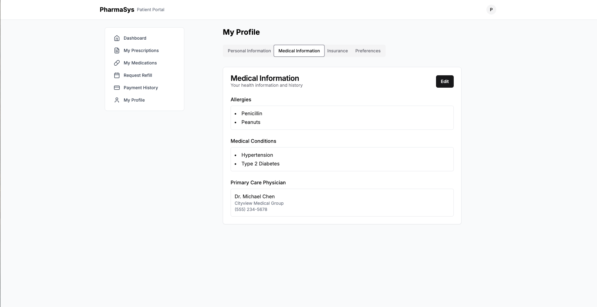 |


---

## 🛠️ Tech Stack

- Next.js 15
- React 19
- TypeScript
- Tailwind CSS
- Radix UI
- shadcn/ui
- pnpm

---

## 💻 Getting Started

### Prerequisites

- Node.js (v18 or v20+ recommended)
- pnpm globally: `npm install -g pnpm`

### Run locally

```bash
pnpm install
pnpm dev
